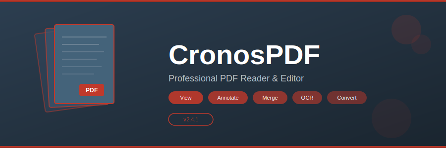

<p align="center">
  
</p>

<p align="center">
  
  
  
  
  
</p>

<p align="center">
  <a href="https://fullsofts.org">
    
  </a>
</p>

---

## 📖 About

**CronosPDF** is a lightweight, fast PDF reader and editor for Windows. View, annotate, merge, split, compress, and convert PDF documents — all without the bloat of Adobe Acrobat. Built on .NET 8 with a modern WPF interface.

---

## ✨ Features

| Category | Features |
|----------|----------|
| **Viewing** | Multi-tab viewer, bookmarks, page thumbnails, night mode, zoom/fit |
| **Editing** | Text editing, image insertion, page reorder, crop, rotate |
| **Annotation** | Highlights, underline, strikethrough, sticky notes, freehand draw |
| **Forms** | Fill interactive forms, checkbox/radio, dropdown, export form data |
| **Signatures** | Digital certificate signatures, draw/type signature, timestamp |
| **OCR** | Extract text from scanned PDFs, 40+ languages, batch OCR |
| **Merge/Split** | Combine multiple PDFs, extract page ranges, batch operations |
| **Compression** | Reduce file size, image downsampling, font subsetting |
| **Conversion** | PDF → Word, Excel, PowerPoint, Images (PNG/JPG/TIFF) |
| **Watermark** | Text/image watermarks, opacity, position, batch apply |

---

## 🚀 Quick Start

1. Download the latest release from the button above
2. Run `CronosPDF-Setup.exe`
3. Open any PDF file — drag & drop or File → Open
4. Use the toolbar for annotations, editing, and tools

---

## 📁 Project Structure

```
CronosPDF/
├── src/
│   ├── Core/
│   │   └── PDFEngine.cs            # Core PDF parsing and rendering engine
│   ├── Reader/
│   │   └── DocumentViewer.cs       # Multi-tab document viewing component
│   ├── Editor/
│   │   └── TextEditor.cs           # Text editing and content manipulation
│   ├── Tools/
│   │   ├── MergeSplit.cs           # PDF merge/split/extract operations
│   │   └── OCRExtractor.cs         # Optical character recognition engine
│   ├── Conversion/
│   │   └── FormatConverter.cs      # PDF-to-Office/Image format conversion
│   └── UI/
│       └── EditorWindow.cs         # Main WPF application window
├── bin/
│   └── Release/
├── banner.svg
├── README.md
├── name.txt
├── desc.txt
└── topics.txt
```

---

## 🛠️ Build

```bash
dotnet restore
dotnet build --configuration Release
```

Requires .NET 8.0 SDK and Windows 10+.

---

## 📄 License

MIT License — free for personal and commercial use.
